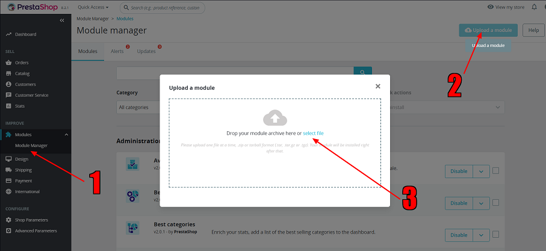
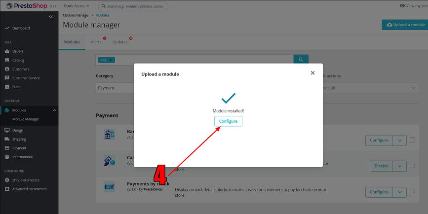
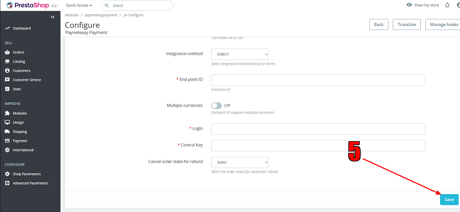

# Plugin for Prestashop

Tested on versions 9.0.2, 8.2.3, 1.7.8.11.

# Installation and configuration

1. In admin section "Improve" click "Module Manager"
2. Then "Upload a module"
3. And select or drag file <a href="https://github.com/payneteasy/php-plugin-prestashop-1/releases/download/v1.4.2/payneteasypayment.zip">payneteasypayment.zip</a> 
4. After installation completed, click "Configure" 
5. And then after filling necessary parameters, click "Save" 
6. Installation and configuration completed.
